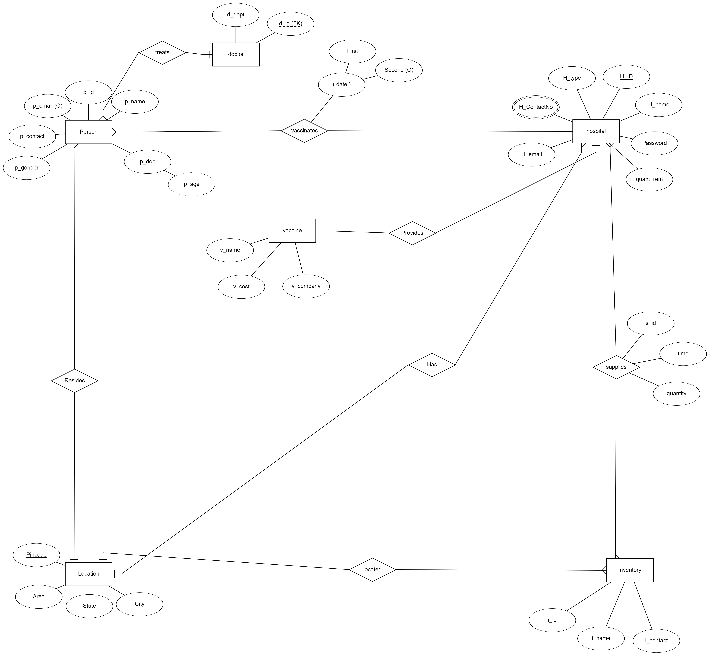
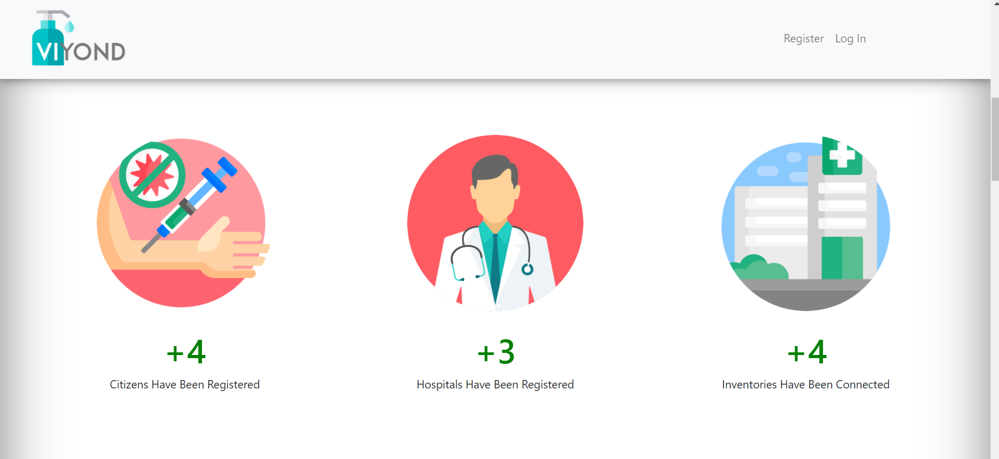
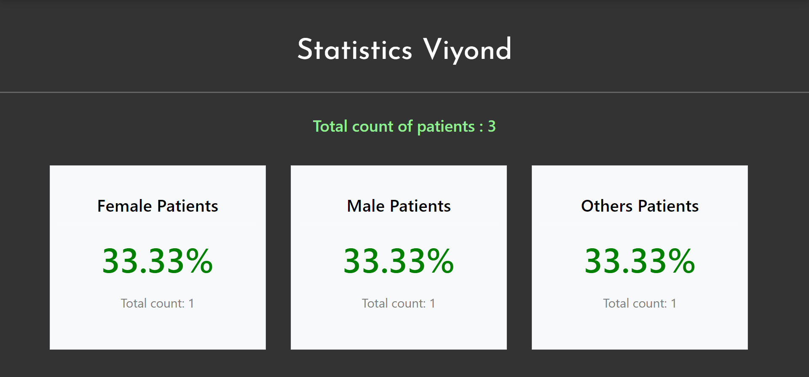

# VIYOND 
#### _V for Virus, Will not Go Beyond.._ <br>
<br><br>
This project is developed as an academic project for DBMS subject and <b>AMOC 2021</b>. It is Web Application based on management of Corona Vaccine which runs on localhost server.

### Prerequisites
Must haves:
- MYSQL(Using XAMPP)
- Browser(That supports HTML and CSS)
- Terminal that supports Nodejs and git commands.

### Installing
To install all the dependencies write the following command on your terminal:<br>
`npm install`
<br><br>
Dependencies that are used for the project include:<br>
`const express = require("express");`<br>
`const bodyParser = require("body-parser");`<br>
`const ejs = require("ejs");`<br>
`const mysql = require("mysql");`<br>
`const dotenv = require("dotenv");`<br>
`const bcrypt = require("bcryptjs");`<br>
`const jwt = require("jsonwebtoken");`<br>
`const cookieParser = require("cookie-parser");`<br>

## Getting Started
Firstly we recommend to install Hyper terminal or any other prompt that supports Nodejs. After the installation clone the files in your pc, traverse to the cloned folder in your pc through your terminal and then use the command `npm start` to run it on localhost. Make sure before running the project, you create the database in your xampp server by pasting the commands in tables.sql file. On starting the execution, the project will run on port 3000.<br>
We have also used PL-SQL in our project. Make sure you also add the procedures, triggers and functions of pl sql (from tables.sql file) in your xampp server before running the project.

## ER Diagram

<br>

## Mysql Connection
```
const mysql = require("mysql");

exports.start = mysql.createConnection({ 
  host: process.env.DATABASE_HOST, 
  user: process.env.DATABASE_USER, 
  password:process.env.DATABASE_PWD,
  database : process.env.DATABASE
});
```
```
con.start.connect((err) => {
  if (err) throw err;
  console.log('connected');
});
```


## The Concept Behind
<br>Our web app using mysql database manages all the patients, hospital and inventory data.<br><br>

<br><br>
Inventory supplies vaccine to any specific hospitals. Each hospital provides a particular brand of vaccine (Say Covaxin or Covishield). Patients can register for hospitals in their area and the hospital can view all the patient requests for vaccine in their hospital on creating an account and logging in inside Viyond. This aids in easy management of data for the hospitals. All Inventory details are visible in the hospital profile page.Also hospitals can add data in the inventory page inside their profile that shows all inventory that are linked to that hospital and quantity of vaccines they have supplied to the respective hospital in the past. Hospitals can also handle information related to patients and add the dates when the patients received their first and second dose of the vaccine. All this data is instantly updated in the databse. The site is end to end validated.<br><br><br>
We also provide a statistics page. Site viewers can view statistics of percentage of male, female and others category patients who have registered in our website. <br><br>

<br><br>There are various other details that are shown through various mysql queries. Data like percentage of patients who have received different vaccines and the number of doses different patients have received. All this data helps the viewers to analyse and make conclusions.<br><br>

<br><br> We have also shown the total hospitals that have registered in our website, along with the count and percentage of those which are private and government. This helps the viewers get to know their choices and helps in easy analysis of information.<br><br>

<br>

## Built With
- HTML - Markup language
- CSS - Style Sheet language
- Javascript- Client Scripting language
- MySQL - Database Management
- node.js - Backend Development environment
- express.js - Fast, unopinionated, minimalist web framework for Node.js

## Contributors
- Sakshi Jain (U19CS048)
- Himani Verma (U19CS075)
- Riya Sharma (U19CS079)
- Esha Srivastav (U19CS109)

